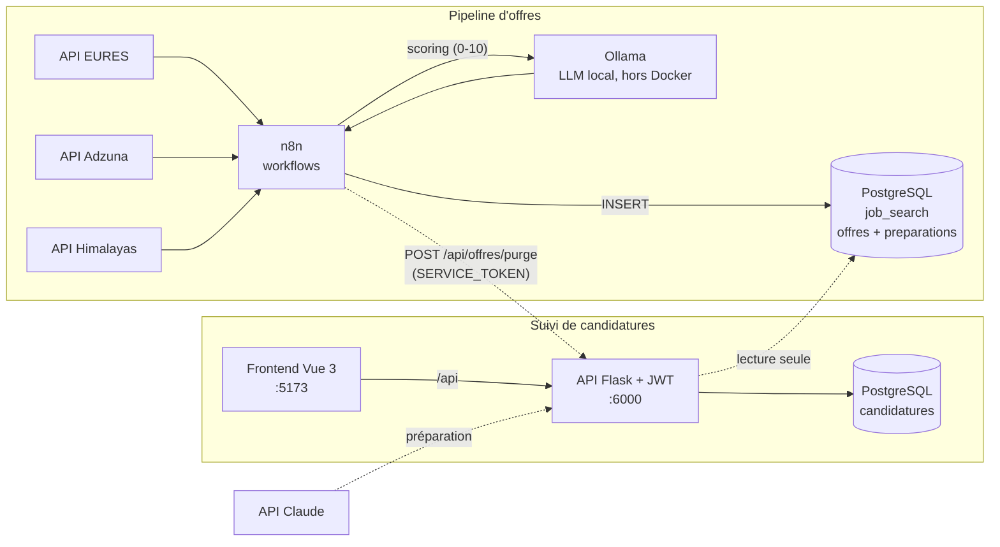

# Plateforme de recherche d'emploi

Plateforme personnelle qui automatise la recherche d'emploi de bout en bout :
collecte quotidienne d'offres, scoring par IA locale, préparation de candidature
assistée, et suivi des démarches — le tout lancé d'une seule commande.

| Application | Rôle |
|---|---|
| **Pipeline d'offres** | Collecte automatique (EURES, Adzuna, Himalayas), scoring 0–10 par LLM local (Ollama), stockage PostgreSQL |
| **Suivi de candidatures** | Application web (Vue 3 + Flask, authentification JWT) : catalogue d'offres, préparation assistée, registre des candidatures |

## Le point d'architecture à connaître avant tout

**Deux instances PostgreSQL distinctes, et c'est délibéré.**

- `job_search` (conteneur `postgres`) : tables `offres` et `preparations`. C'est
  un **catalogue volatile** — n8n le réalimente à chaque run, il peut être purgé
  ou vidé sans conséquence.
- `candidatures` (conteneur `suivi-db`) : tables `candidatures`, `users`,
  `recherches_favoris`. C'est un **registre persistant** — vos démarches, qu'un
  run du pipeline ne doit jamais effacer.

Conséquence directe : **aucune clé étrangère n'est possible entre les deux**. Le
backend Flask ouvre deux connexions (`get_db_connection` et
`get_offres_db_connection`) et toute jointure se fait en Python.

C'est pourquoi une candidature **recopie** les champs de l'offre — titre,
entreprise, pays, ville, lien, source — au moment de sa création. Cet instantané
est ce qui la garde lisible après la disparition de l'offre. `candidatures.offre_id`
ne sert qu'à retrouver la préparation associée, jamais à afficher les données.

Autre conséquence : une offre est considérée « déjà traitée » **parce qu'une
candidature existe**, jamais parce qu'elle porte tel statut. Un run peut
réinsérer l'offre et remettre son statut à « Nouvelle » ; la candidature, elle,
survit, et l'offre reste hors de la liste par défaut.

## Architecture



Chaque jour, n8n interroge les API d'offres, déduplique, fait noter chaque offre
par un LLM local selon un profil de candidat précis, et enregistre les offres
pertinentes (score ≥ 6). La page Offres permet de filtrer, trier, préparer une
candidature (CV adapté, lettre, questions d'entretien) et de basculer une offre
en démarche suivie.

## Prérequis

- Docker et Docker Compose
- [Ollama](https://ollama.com) sur l'hôte avec le modèle `qwen2.5:7b` (scoring)
- Une clé API Anthropic si vous voulez la préparation de candidature réelle
  (sinon le mode simulation, actif par défaut, suffit à faire tourner l'écran)

## Installation

```bash
git clone <url-du-depot> && cd suivie

cp .env.example .env
# → éditer .env : voir la table des variables ci-dessous

# Volumes de données (première installation uniquement)
docker volume create n8n-jobsearch_postgres_data
docker volume create n8n-jobsearch_n8n_data
docker volume create suivie_pgdata

docker compose up -d --build
```

Puis créer le compte administrateur (une seule fois) :

```bash
docker compose exec backend python create_admin.py
```

Enfin, côté n8n (`http://localhost:5678`) : importer
`pipeline-offres/workflows/recherche-emploi.json`, recréer les credentials
PostgreSQL (voir `pipeline-offres/GUIDE-N8N-POSTGRES.md`) et les clés API Adzuna,
puis créer un credential **Header Auth** pour le nœud de purge :

- nom de l'en-tête : `Authorization`
- valeur : `Bearer <votre SERVICE_TOKEN>`

## Variables d'environnement

Toutes vivent dans `.env`, jamais versionné. `.env.example` en est le modèle.

| Variable | Obligatoire | Rôle |
|---|---|---|
| `SUIVI_DB_USER` / `SUIVI_DB_NAME` / `SUIVI_DB_PASSWORD` | oui | Base `candidatures` |
| `PIPELINE_DB_USER` / `PIPELINE_DB_NAME` / `PIPELINE_DB_PASSWORD` | oui | Base `job_search`. Le backend s'en sert aussi pour lire les offres |
| `JWT_SECRET` | oui | Signature des JWT. Le backend **refuse de démarrer** sans. `openssl rand -hex 32` |
| `SERVICE_TOKEN` | pour n8n | Authentifie les appels machine. N'ouvre **que** `POST /api/offres/purge`. N'expire pas, donc chaque appel est tracé dans les logs. `openssl rand -hex 32` |
| `ANTHROPIC_API_KEY` | si `MOCK_CLAUDE=false` | Préparation de candidature |
| `MOCK_CLAUDE` | non (défaut `true`) | `true` = réponses simulées, aucun appel facturé |
| `PREPARATION_MODELE` | non | Défaut `claude-opus-5` |
| `PREPARATION_EFFORT` | non | Défaut `medium` |
| `PREPARATION_MAX_TOKENS` | non | Défaut `8000`. Plafond thinking + réponse, **pas** un levier de coût |
| `PREPARATION_TIMEOUT` | non | Secondes, défaut `180` |
| `PREPARATIONS_PAR_JOUR` | non | Défaut `20`. Ne compte que le mode réel |
| `SUIVI_URL` | non | Lien vers le suivi, hérité du dashboard retiré |

## Ports

**Tous les ports sont liés à `127.0.0.1`** : rien n'est joignable depuis le
réseau local. Les services se parlent entre eux par le réseau Docker, que ce
filtrage n'affecte pas.

| Adresse | Service | Note |
|---|---|---|
| `127.0.0.1:5173` | Frontend Vue | seule interface à ouvrir au quotidien |
| `127.0.0.1:5678` | n8n | éditeur de workflows — **sans authentification**, voir Sécurité |
| `127.0.0.1:6000` | API Flask | le frontend et n8n l'atteignent par le réseau Docker |
| `127.0.0.1:5432` | PostgreSQL pipeline | base `job_search` |
| `127.0.0.1:5433` | PostgreSQL suivi | base `candidatures` |

Pour consulter depuis un autre appareil, ne republiez pas les ports sur
`0.0.0.0` : passez par un tunnel SSH (`ssh -L 5173:127.0.0.1:5173 <hôte>`).
Republier `5678` sans avoir posé `N8N_BASIC_AUTH_*` exposerait les credentials
n8n en clair.

## Maintenance

### La règle à ne pas oublier

> **Toute modification de `package.json` ou de `requirements.txt` exige un
> rebuild d'image.** Un `npm install` ou un `pip install` lancé dans un
> conteneur vivant disparaît au premier `docker compose down`.

Le frontend monte `- /app/node_modules` en **volume anonyme**, peuplé depuis
l'image à la création du conteneur. Le piège est silencieux : tant qu'on se
contente de `docker compose restart`, tout marche ; c'est au premier `down`/`up`
que la pile refuse de démarrer, avec un message qui ne dit pas d'où vient le
problème (`Cannot find module 'tailwindcss'`). C'est arrivé le 04/08/2026.

```bash
# Après avoir touché package.json ou requirements.txt :
docker compose build frontend      # ou backend
docker compose up -d --force-recreate --renew-anon-volumes frontend
```

Même logique pour `tailwind.config.js` : son champ `content` ne scanne que
`Offres.vue`, `App.vue`, `components/offres/**` et `components/suivi/**`. **Un
nouveau fichier utilisant Tailwind doit y être ajouté**, sinon ses classes ne
sont générées que si elles apparaissent par hasard ailleurs — l'écran tient
alors debout par coïncidence.

### Commandes courantes

```bash
./maintenance.sh              # état des lieux, ne modifie rien
./maintenance.sh --nettoyer   # purge les artefacts régénérables

docker compose logs -f backend        # journaux applicatifs
docker compose up -d backend          # recharge le .env (restart ne le relit PAS)
```

### Sauvegardes

Les dumps vont dans `sauvegardes/`, ignoré par git — le contenu réel des bases
ne part pas sur GitHub mais survit aux sessions.

```bash
docker exec suivi-db pg_dump -U <SUIVI_DB_USER> -d candidatures \
  > sauvegardes/$(date +%F)-candidatures.sql
```

### Scripts SQL

`pipeline-offres/migrations/` contient des scripts rejouables, à passer à psql :

- `nettoyer-chaines-null.sql` — remet à NULL les colonnes portant la chaîne
  littérale `"null"`, que `String(null)` produit côté pipeline
- `normaliser-id-himalayas.sql` — **en réserve, non appliquée** : la bascule
  initiale s'est faite par TRUNCATE puis réexécution du pipeline

## Sécurité

Ce qui est en place :

- Secrets en `.env`, jamais versionné. `profil.json` (CV réel) l'est aussi
- Mots de passe hachés en bcrypt, JWT signés HS256 avec expiration 24 h
- `SERVICE_TOKEN` comparé en temps constant (`hmac.compare_digest`) et limité à
  une seule route
- Inscription publique mais compte créé en `role=user`, `is_approved=false` :
  aucune escalade possible, un admin doit approuver
- **Tous les ports liés à `127.0.0.1`** : plus rien n'est joignable depuis le
  réseau local. Vérifié en tentant l'accès sur l'IP LAN de la machine
- Aucun secret dans l'historique git : scan complet des blobs de tous les
  commits, contre les motifs de clés API, jetons, clés privées et JWT

**Ce qui ne l'est pas :**

- **n8n n'a aucune authentification.** L'éditeur, et donc les credentials qu'il
  stocke (PostgreSQL, Notion), sont accessibles à qui l'atteint. C'est la
  liaison locale qui l'en protège aujourd'hui, pas un mot de passe. Pour une
  vraie défense en profondeur : `N8N_BASIC_AUTH_ACTIVE` /
  `N8N_BASIC_AUTH_USER` / `N8N_BASIC_AUTH_PASSWORD`
- `/api/register` n'est pas limité en débit. Sans exposition réseau la portée
  est faible, mais un accès local suffit à créer des comptes en série — ils
  restent en attente d'approbation

## Structure du dépôt

```
.
├── docker-compose.yml        # 5 services, rétention des logs, ports
├── maintenance.sh            # entretien (simulation par défaut)
├── .env.example              # modèle de configuration
├── profil.json               # CV réel — ignoré par git, monté en lecture seule
├── sauvegardes/              # dumps locaux — ignoré par git
├── pipeline-offres/
│   ├── workflows/            # export du workflow n8n
│   ├── postgres-init/        # schéma de job_search (1er démarrage uniquement)
│   ├── migrations/           # scripts SQL rejouables
│   ├── dashboard/            # Streamlit — abandonné, retiré du compose
│   └── GUIDE-N8N-POSTGRES.md
└── suivi-candidatures/
    ├── backend/              # API Flask ; services/ = client API Claude
    └── frontend/
        ├── Offres.vue        # page catalogue
        ├── App.vue           # vue de suivi
        └── components/
            ├── offres/       # tableau, carte, préparation, primitives UI
            └── suivi/        # tableau de suivi, saisie rapide, libellés
```

`components/suivi/libelles.js` est le point de vérité partagé par les deux
tableaux : libellés des statuts, formatage des dates, et `classeStatut()` qui
donne le code couleur. Les couleurs elles-mêmes sont des variables de thème dans
`assets/offres.css`, déclinées en clair et en sombre.

## Reprise après une longue absence

1. `docker compose up -d` puis `docker compose ps` — les 5 services doivent être
   `Up`, les deux PostgreSQL `healthy`
2. `./maintenance.sh` pour voir ce qui a grossi
3. Vérifier que le workflow n8n est toujours actif (`http://localhost:5678`)
4. Les volumes sont déclarés `external: true` : ils survivent à tout `down`,
   y compris `down --volumes`

